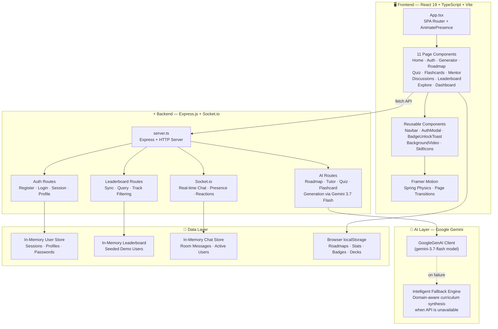
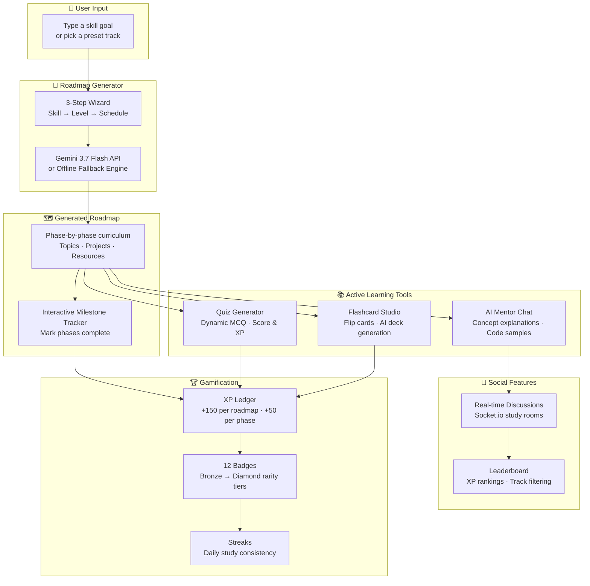
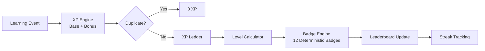
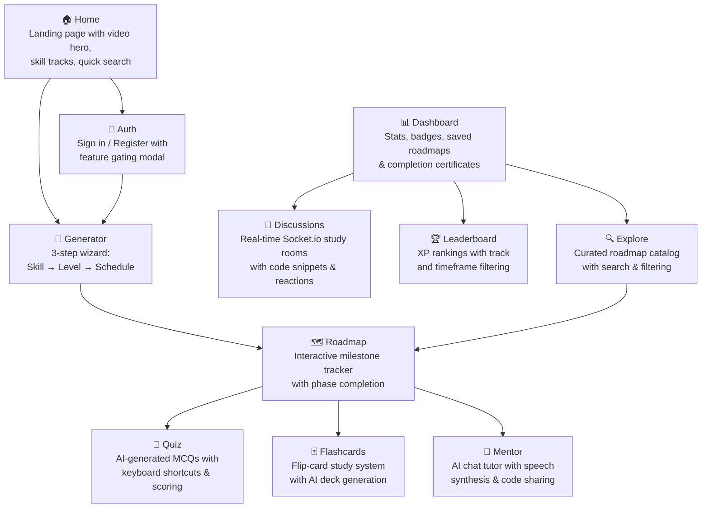

# 🎯 LearnPath AI

### Personalized AI-Powered Learning Path Generator with Interactive Study Tools

[](https://react.dev)
[](https://typescriptlang.org)
[](https://vitejs.dev)
[](https://tailwindcss.com)
[](https://socket.io)
[](LICENSE)

> **LearnPath AI** is an AI-powered personalized learning platform that generates custom roadmaps, interactive quizzes, flashcards, and a 24/7 AI mentor — all in one app. Built with React 19, TypeScript, Express.js, Socket.io, and Google Gemini AI.

---

## ✨ Key Features

| Feature | Description |
|---------|-------------|
| 🗺️ **AI Roadmap Generator** | 3-step wizard generates personalized milestone-driven curricula via Gemini 3.7 Flash with intelligent offline fallback |
| 🧠 **AI Mentor Chat** | 24/7 chat tutor with speech synthesis, code snippet sharing, and concept explanations |
| 📝 **Dynamic Quiz Engine** | Real-time AI-generated multiple-choice quizzes with score tracking and XP rewards |
| 🃏 **Flashcard Studio** | Flip-card study system with AI deck generation, keyboard navigation, and mastery tracking |
| 💬 **Live Discussions** | Real-time Socket.io study rooms with code sharing, reactions, and typing indicators |
| 🏆 **Leaderboard** | XP-based global rankings with track filtering (AI, Full-Stack, Data Science, DevOps) |
| 📊 **Dashboard** | Stats overview: streaks, badges, saved roadmaps, quizzes passed, flashcards mastered |
| 🏅 **Badge System** | 12 achievement badges across 7 categories with rarity tiers (Bronze → Diamond) |
| 🔐 **Auth System** | Register/login with session tokens, feature gating for protected pages |
| 🎨 **Animated UI** | Framer Motion page transitions, confetti effects, canvas particle backgrounds |

---

## 🏗️ Architecture



---

## 🔄 System Flow



---

## 🗂️ Project Structure

```
LearnPath-AI/
├── server.ts                    # Express.js backend + Socket.io + Gemini AI
├── package.json                 # Dependencies & scripts
├── tsconfig.json                # TypeScript config (ES2022, JSX, bundler)
├── vite.config.ts               # Vite + React + Tailwind CSS 4
├── index.html                   # HTML entry point (Plus Jakarta Sans)
├── .env.example                 # GEMINI_API_KEY (optional)
├── metadata.json                # Freebuff project metadata
│
└── src/
    ├── main.tsx                  # React root mount (StrictMode)
    ├── App.tsx                   # SPA router, auth gating, state management
    ├── index.css                 # Tailwind CSS 4 import
    ├── types.ts                  # All TypeScript interfaces & type definitions
    │
    ├── components/
    │   ├── Navbar.tsx            # Global navigation bar with auth state
    │   ├── AuthModal.tsx         # Login/Register modal with feature gating
    │   ├── BadgeUnlockToast.tsx  # Confetti badge unlock notification
    │   ├── BackgroundVideo.tsx   # Cloudinary hero video with autoplay retry
    │   ├── HeroContent.tsx       # Legacy hero content (unused)
    │   ├── KeySkillsSection.tsx  # Legacy skill cards (unused)
    │   ├── SkillIcons.tsx        # Custom SVG skill icons (unused)
    │   ├── SkillModal.tsx        # Legacy skill detail modal (unused)
    │   ├── TechBackgroundCanvas.tsx  # Legacy canvas background (unused)
    │   ├── TrialModal.tsx        # Legacy trial signup modal (unused)
    │   │
    │   └── pages/
    │       ├── HomePage.tsx      # Landing page with hero, search, skill tracks
    │       ├── AuthPage.tsx      # Full-page auth (sign in / sign up)
    │       ├── GeneratorPage.tsx # 3-step roadmap generation wizard
    │       ├── RoadmapPage.tsx   # Interactive milestone tracker
    │       ├── QuizPage.tsx      # AI quiz engine with keyboard shortcuts
    │       ├── FlashcardsPage.tsx # Flip-card study system + AI deck gen
    │       ├── MentorPage.tsx    # AI chat tutor with speech synthesis
    │       ├── DiscussionsPage.tsx # Socket.io real-time study rooms
    │       ├── LeaderboardPage.tsx # XP rankings with track filters
    │       ├── ExplorePage.tsx   # Curated roadmap catalog
    │       └── DashboardPage.tsx # Stats, badges, saved roadmaps, certs
    │
    └── data/
        ├── mockRoadmaps.ts       # 3 curated roadmaps (AI, Full-Stack, Data Science)
        ├── flashcardDecks.ts     # 3 pre-built flashcard decks (14 cards total)
        └── badgesData.ts         # 12 achievement badges with progress tracking
```

---

## 🛠️ Tech Stack

| Layer | Technology | Purpose |
|-------|-----------|---------|
| **Frontend** | React 19 + TypeScript 5.8 | UI framework with strict typing |
| **Build** | Vite 6 | Fast HMR dev server & production bundler |
| **Styling** | Tailwind CSS 4 | Utility-first CSS via Vite plugin |
| **Animation** | Framer Motion (`motion/react`) | Page transitions, spring physics, AnimatePresence |
| **Backend** | Express.js 4 | REST API server + SPA static hosting |
| **Real-time** | Socket.io 4 | WebSocket chat, presence, reactions |
| **AI** | Google Gemini 3.7 Flash | Roadmap, quiz, flashcard, and tutor generation |
| **Icons** | Lucide React | Consistent icon library (40+ icons used) |
| **Effects** | canvas-confetti | Celebration particles on achievements |
| **Fonts** | Plus Jakarta Sans | Modern geometric sans-serif (Google Fonts) |

---

## 🚀 Getting Started

### Prerequisites

- **Node.js 18+** (recommended: 20+)
- **npm** or compatible package manager

### Installation

```bash
# Clone the repository
git clone https://github.com/snehakumari9696/LearnPath-AI.git
cd LearnPath-AI

# Install dependencies
npm install

# (Optional) Configure Gemini API key
cp .env.example .env
# Edit .env and add your GEMINI_API_KEY
```

### Development

```bash
# Start dev server with hot reload
npm run dev
```

Open **http://localhost:3000** in your browser.

> The app runs fully offline with intelligent fallbacks when no Gemini API key is configured.

### Production Build

```bash
# Build frontend + bundle server
npm run build

# Start production server
npm start
```

### Type Checking

```bash
# Run TypeScript type checker
npm run lint
```

---

## 📡 API Reference

### Authentication

| Endpoint | Method | Description |
|----------|--------|-------------|
| `/api/auth/register` | POST | Create new account (name, email, password, targetRole) |
| `/api/auth/login` | POST | Sign in (email, password) — auto-creates account if not found |
| `/api/auth/me` | GET | Verify session token (Bearer auth header) |
| `/api/auth/update-profile` | POST | Update user profile fields |
| `/api/auth/logout` | POST | Sign out |
| `/api/auth/forgot-password` | POST | Simulated password reset |

### AI Generation

| Endpoint | Method | Description |
|----------|--------|-------------|
| `/api/generate-roadmap` | POST | Generate personalized learning roadmap via Gemini |
| `/api/ai-tutor` | POST | Chat with AI mentor (context-aware explanations) |
| `/api/generate-quiz` | POST | Generate MCQ quiz on any topic/difficulty |
| `/api/ai-explain-topic` | POST | Generate in-depth study guide flashcard |
| `/api/generate-flashcard-deck` | POST | Generate 5-card study deck on any topic |

### Leaderboard

| Endpoint | Method | Description |
|----------|--------|-------------|
| `/api/leaderboard` | GET | Fetch ranked leaderboard (query: `track`, `timeframe`) |
| `/api/leaderboard/sync` | POST | Sync current user stats to leaderboard |

### System

| Endpoint | Method | Description |
|----------|--------|-------------|
| `/api/health` | GET | Health check (returns AI status) |

### Socket.io Events

| Event | Direction | Description |
|-------|-----------|-------------|
| `join_room` | Client → Server | Join a study room with user profile |
| `chat_history` | Server → Client | Receive room message history |
| `send_message` | Client → Server | Send message with optional code snippet |
| `receive_message` | Server → Client | New message broadcast |
| `toggle_reaction` | Client → Server | Add/remove emoji reaction |
| `reaction_updated` | Server → Client | Updated reactions for a message |
| `typing` / `user_typing` | Bidirectional | Typing indicators |
| `room_users` | Server → Client | Active users in current room |

---

## 🎮 Gamification System



### XP Rewards

| Action | XP Earned |
|--------|-----------|
| Generate a roadmap | +150 |
| Complete a phase | +50 |
| Pass a quiz | +100 + (score × 50) |
| Master a flashcard | +50 |
| Send a discussion message | Triggers badge check |
| Badge unlock | +100 to +1000 (varies by rarity) |

### Badge Categories

| Category | Badges | Rarity Range |
|----------|--------|-------------|
| Roadmaps | Pioneer Architect, Phase Conqueror, Curriculum Graduate | Bronze → Diamond |
| Quizzes | Quiz Master, Technical Evaluator | Silver → Gold |
| Flashcards | Memory Guru, Grandmaster Recall | Silver → Platinum |
| Streaks | Streak Champion | Gold |
| Community | Discussion Catalyst | Bronze |
| Mentor | AI Collaborator | Bronze |
| XP | Deep Work Champion, Top 10 Contender | Gold |

---

## 🖥️ Frontend Pages



---

## 🔧 Configuration

### Environment Variables

| Variable | Default | Description |
|----------|---------|-------------|
| `GEMINI_API_KEY` | _(empty)_ | Google Gemini API key (optional — app works offline without it) |

> All AI features have intelligent fallback engines that generate domain-aware content when the API is unavailable.

### Scripts

| Command | Description |
|---------|-------------|
| `npm run dev` | Start Vite dev server with HMR on port 3000 |
| `npm run build` | Build frontend + bundle server to `dist/` |
| `npm start` | Run production server from `dist/server.cjs` |
| `npm run lint` | Run TypeScript type checker (`tsc --noEmit`) |

---

## 🎨 UI Design System

The app uses a **dark space theme** with:

- **Background**: Deep navy-to-black gradients (`#040e21` base)
- **Cards**: Glassmorphism with `backdrop-blur-xl` and subtle borders (`border-white/10`)
- **Accents**: Indigo → Purple → Pink gradient spectrum
- **Typography**: Plus Jakarta Sans (300–800 weights)
- **Animations**: Framer Motion spring physics, `AnimatePresence mode="wait"` page transitions
- **Effects**: Canvas-confetti on achievements, animated particle backgrounds, video hero

---

## 📄 License

MIT
      