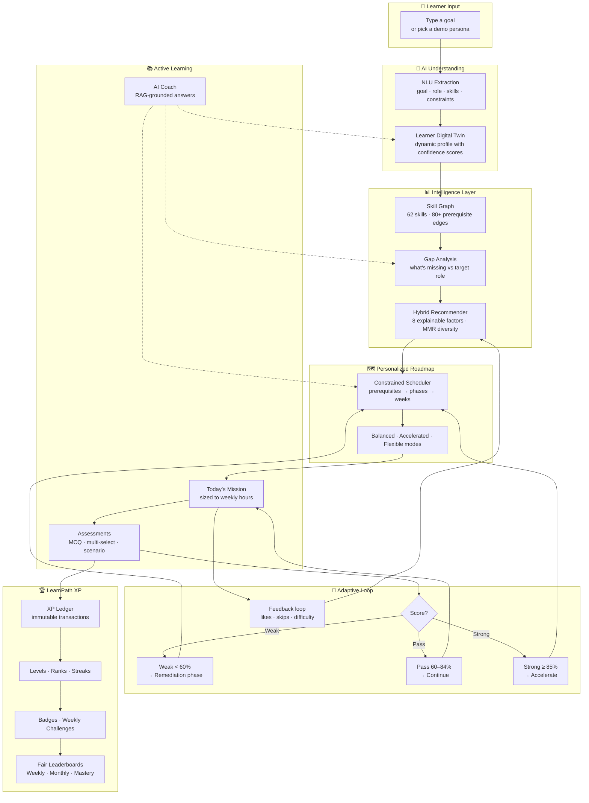
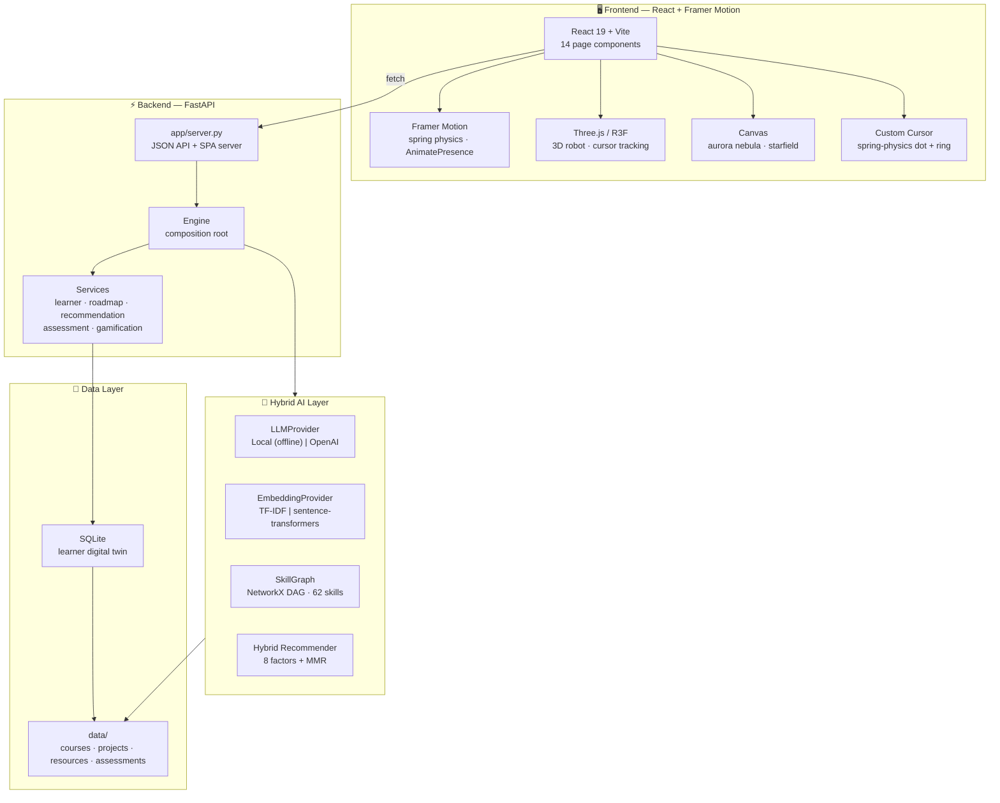
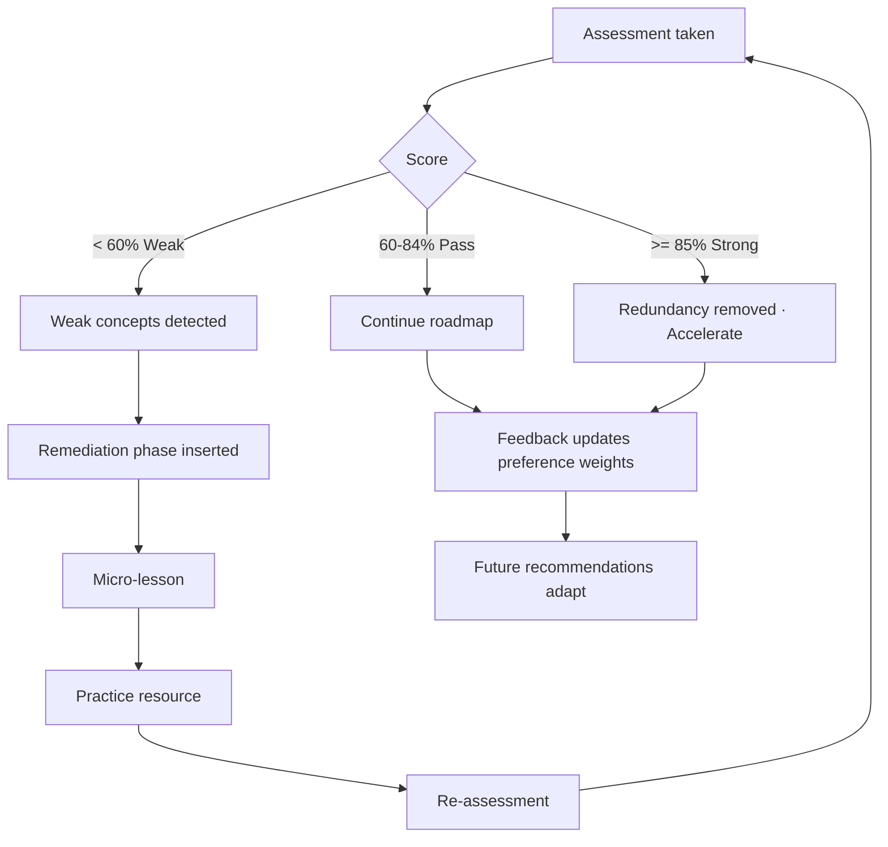
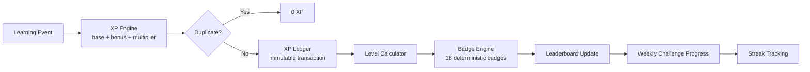

# 🧭 LearnPath AI

### Your Goal. Your Skills. Your Adaptive Learning Journey.

[](https://python.org)
[](https://react.dev)
[](https://www.framer.com/motion/)
[](https://fastapi.tiangolo.com)
[](#testing)
[](LICENSE)

> **LearnPath AI** is an AI-powered adaptive learning operating system that transforms a learner's goal into an executable, personalized, measurable journey. It is not a course recommender — it is an AI learning companion that continuously adapts.

---

## ✨ Frontend Highlights

| Feature | Technology |
|---------|-----------|
| **3D Robot Background** | Three.js / React Three Fiber — eyes track your cursor |
| **Custom Cursor** | Spring-physics dot + trailing ring, hover effects |
| **Liquid Page Transitions** | AnimatePresence mode="wait" with blur + slide |
| **Staggered Animations** | Spring-physics entrances on all pages |
| **Glassmorphism** | Cursor-proximity glow, backdrop blur, gradient borders |
| **Aurora Canvas** | Nebula blobs, parallax starfield, shooting stars |
| **Magnetic Buttons** | Cursor-tracking pull + spring compression |

---

## How It Works — System Flow



---

## What Makes It Different

| Generic Recommenders | LearnPath AI |
|---|---|
| "You might also like…" | Skill gap analysis → prerequisite-aware sequencing |
| One-size-fits-all paths | Adaptive: weak scores insert remediation, strong scores accelerate |
| No progress tracking | Daily mission, streaks, XP ledger, career readiness gauge |
| No explainability | Every recommendation has machine-readable "Why this?" reasons |
| Requires internet | Fully offline — local LLM fallback, TF-IDF embeddings, zero API keys |
| Static content | Continuously adapts from assessments, feedback, and behavior |

---

## Key Features

### 🎯 Smart Onboarding
Conversational goal intake with an editable "AI Understanding" panel. One-click demo personas (ML Engineer, Data Scientist, Cybersecurity Analyst, Cloud Engineer).

### 📊 Skill Intelligence
62-skill ontology with prerequisite closure, topological ordering, gap heatmap, radar chart, and before/after proficiency bars.

### 🗺️ Adaptive Roadmap
Constrained scheduling: prerequisites → phases → weeks → deadline feasibility. Three modes — Balanced, Accelerated, Flexible — with live re-planning.

### 🎯 Explainable Recommendations
8-factor scoring (semantic relevance, gap coverage, goal alignment, prerequisite fit, difficulty fit, preference fit, time fit, feedback signal) with MMR diversity. Every result carries a "Why this?" explanation.

### 🧠 Knowledge Assessments
13 knowledge checks with MCQ/multi-select/scenario/coding questions. Concept-level weak-area detection feeds directly into the adaptive engine.

### 💬 AI Coach
RAG-grounded assistant that knows your profile, roadmap, gaps, and assessment history. Honest when it doesn't know.

### 🚀 Career Readiness
0–100 readiness index across Technical Skills, Projects, Problem Solving, Deployment, and Portfolio. "What's needed for 90%?" simulator.

### 🏆 LearnPath XP
Outcome-based gamification: XP ledger, levels, ranks, streaks, 18 badges, weekly challenges. Anti-farm protected — server is the only XP authority.

### 🏅 Fair Leaderboards
All-Time, Weekly, Monthly, Skill, and Mastery boards. Weekly & monthly XP resets so new learners can always compete. Opt-out privacy toggle.

---

## Architecture



---

## Tech Stack

| Layer | Technology |
|---|---|
| **Backend** | Python 3.11 · FastAPI · Uvicorn · scikit-learn · NetworkX · Pandas · NumPy · SQLite |
| **Frontend** | React 19 · Vite · Framer Motion · React Router · React Three Fiber · Three.js |
| **3D/Animation** | Spring physics · AnimatePresence · useMotionValue · useSpring · custom cursor |
| **AI/ML** | TF-IDF embeddings · NetworkX DAG · 8-factor recommender · MMR diversity · RAG coaching |
| **Testing** | pytest · httpx · 112 tests incl. full end-to-end FastAPI flow |
| **Optional** | OpenAI API · sentence-transformers |

---

## Installation

```bash
# Clone the repository
git clone https://github.com/rishabhverma007/LearnPath-AI.git
cd LearnPath-AI

# Create virtual environment
python -m venv .venv
source .venv/bin/activate        # Windows: .venv\Scripts\activate

# Install Python dependencies
pip install -r requirements.txt

# Install React frontend dependencies
cd frontend-v2
npm install

# Build the React frontend
npm run build
cd ..
```

---

## Configuration

Copy `.env.example` to `.env` — all values are optional (the app runs fully offline):

```bash
cp .env.example .env
```

| Variable | Default | Description |
|---|---|---|
| `LLM_PROVIDER` | `local` | `local` (offline) or `openai` |
| `OPENAI_API_KEY` | — | API key for OpenAI (enables richer coaching) |
| `OPENAI_MODEL` | `gpt-4o-mini` | Model name |
| `EMBEDDING_PROVIDER` | `tfidf` | `tfidf` (offline) or `sentence-transformers` |
| `DATABASE_PATH` | `data/learnpath.db` | SQLite database path |

---

## Running

```bash
# Start the server (serves both API and React frontend)
python -m uvicorn app.server:app --port 8765
```

Open **http://localhost:8765** in your browser. No API keys required.

1. Click **"Try a demo persona"** or sign up
2. Pick a persona or type your own goal
3. Explore your personalized journey

### Development Mode

```bash
# Terminal 1: Backend
python -m uvicorn app.server:app --port 8765

# Terminal 2: React dev server (with hot reload)
cd frontend-v2
npm run dev
```

The dev server runs on port 5173 with proxy to the backend.

---

## Project Structure

```
LearnPath-AI/
├── app/
│   ├── server.py              # FastAPI: JSON API + SPA server
│   ├── config.py              # Weights, thresholds, modes, personas
│   ├── ai/
│   │   ├── embeddings.py      # TF-IDF | sentence-transformers
│   │   ├── llm.py             # Local (offline) | OpenAI provider
│   │   ├── extraction.py      # NLU profile extraction
│   │   ├── prompts.py         # Centralized prompt templates
│   │   └── rag.py             # Knowledge base + Coach service
│   ├── ml/
│   │   ├── recommender.py     # 8-factor scoring + MMR diversity
│   │   ├── path_optimizer.py  # Roadmap generation + adaptive remediation
│   │   ├── career_readiness.py
│   │   ├── daily_mission.py
│   │   ├── what_if.py
│   │   ├── gamification.py    # XP · levels · ranks · streaks · badges
│   │   └── evaluation.py      # Synthetic benchmark metrics
│   ├── graph/
│   │   └── skill_graph.py     # NetworkX DAG: 62 skills, 80+ edges
│   ├── data/                  # Catalogue loader + models
│   ├── database/              # SQLite repository + Learner Digital Twin
│   ├── services/              # Composition root + service layer
│   └── utils/                 # Logging, helpers
├── data/
│   ├── skills.csv             # 62 skills with prerequisites
│   ├── career_roles.csv       # 10 career roles
│   ├── courses.csv            # 52 courses with verified URLs
│   ├── projects.csv           # 25 hands-on projects
│   ├── resources.csv          # 31 micro-resources
│   └── assessments.json       # 13 knowledge checks (52 questions)
├── frontend-v2/               # React + Framer Motion frontend
│   ├── src/
│   │   ├── components/        # 10 reusable components
│   │   │   ├── GlassCard.jsx      # Cursor-glow glassmorphism card
│   │   │   ├── MagneticButton.jsx # Spring-physics magnetic hover
│   │   │   ├── ScrollReveal.jsx   # IntersectionObserver + spring
│   │   │   ├── TextStagger.jsx    # Word-by-word text reveal
│   │   │   ├── BackgroundCanvas.jsx # Aurora + starfield canvas
│   │   │   ├── Robot3D.jsx        # Three.js 3D robot
│   │   │   ├── CustomCursor.jsx   # Spring-physics cursor
│   │   │   ├── PageTransition.jsx # Liquid page transitions
│   │   │   ├── Charts.jsx         # SVG charts (radar, gauge, line, bar)
│   │   │   ├── TopBar.jsx         # Minimal brand + learner chip
│   │   │   ├── Toast.jsx          # Animated notifications
│   │   │   └── BackButton.jsx     # Navigation back button
│   │   ├── pages/             # 14 page components
│   │   │   ├── Landing.jsx        # Hero + demo personas
│   │   │   ├── Auth.jsx           # Sign In / Sign Up
│   │   │   ├── Onboarding.jsx     # Goal analyzer + AI understanding
│   │   │   ├── PageGrid.jsx       # 10-card navigation hub
│   │   │   ├── Journey.jsx        # Roadmap with phases
│   │   │   ├── Skills.jsx         # Gap analysis + radar chart
│   │   │   ├── Recommendations.jsx # Ranked items + explanations
│   │   │   ├── Coach.jsx          # AI chat interface
│   │   │   ├── Assessments.jsx    # Knowledge checks
│   │   │   ├── Dashboard.jsx      # Mission + gamification stats
│   │   │   ├── Career.jsx         # Readiness gauge + what-if
│   │   │   ├── Achievements.jsx   # Badges + challenges
│   │   │   ├── Leaderboard.jsx    # Rankings table
│   │   │   └── Settings.jsx       # Profile editor
│   │   ├── animations.js      # Spring physics config
│   │   ├── api.jsx            # API client + React Context
│   │   ├── App.jsx            # Root layout + routing
│   │   ├── index.css          # All styles
│   │   └── main.jsx           # Entry point
│   ├── vite.config.js         # Vite config + API proxy
│   └── package.json           # Dependencies
├── tests/                     # 112 pytest tests
├── requirements.txt
├── .env.example
└── README.md
```

---

## API Reference

| Endpoint | Method | Description |
|---|---|---|
| `/api/auth/signup` | POST | Create account |
| `/api/auth/signin` | POST | Sign in |
| `/api/auth/guest` | POST | One-click demo mode |
| `/api/auth/me` | GET | Current user |
| `/api/auth/signout` | POST | Sign out |
| `/api/meta` | GET | System metadata |
| `/api/profile/analyze` | POST | NLU goal extraction |
| `/api/learners` | POST | Create learner digital twin |
| `/api/learners/{id}` | GET/PUT/DELETE | Learner CRUD |
| `/api/learners/{id}/roadmap` | POST/GET | Generate / retrieve roadmap |
| `/api/learners/{id}/recommendations` | POST | Ranked recommendations |
| `/api/learners/{id}/skills` | GET | Skill profile + gaps |
| `/api/learners/{id}/items/complete` | POST | Mark item complete (awards XP) |
| `/api/learners/{id}/feedback` | POST | Like / skip / difficulty feedback |
| `/api/learners/{id}/coach` | POST | AI Coach conversation |
| `/api/learners/{id}/mission` | GET | Today's learning mission |
| `/api/learners/{id}/career` | GET | Career readiness index |
| `/api/learners/{id}/whatif` | POST | What-if role simulator |
| `/api/assessments/{id}` | GET | Fetch assessment |
| `/api/learners/{id}/assessments/{id}/submit` | POST | Submit + grade assessment |
| `/api/learners/{id}/micro-lesson` | POST | Generate micro-lesson |
| `/api/learners/{id}/gamification` | GET | XP, level, rank, streak, badges |
| `/api/learners/{id}/xp-history` | GET | XP transaction ledger |
| `/api/learners/{id}/badges` | GET | Earned badges |
| `/api/learners/{id}/streak` | GET | Streak details |
| `/api/leaderboard` | GET | ?scope=global\|weekly\|monthly\|skill\|mastery |
| `/api/challenges/current` | GET | Weekly challenges |
| `/api/challenges/{id}/claim` | POST | Claim challenge reward |
| `/api/learners/{id}/mission/complete` | POST | Complete daily mission |
| `/api/health` | GET | Health check |

---

## Testing

```bash
python -m pytest tests/ -v
```

**112 tests** covering:
- Profile extraction & validation
- Recommendation ranking, explanations & diversity
- Prerequisite ordering & deadline feasibility
- Assessment grading (MCQ, multi-select, malformed input)
- Adaptive remediation & acceleration
- LLM/embedding fallback & coach honesty
- XP calculation, difficulty multipliers, anti-farming
- Badge conditions, streak math, leaderboards
- Challenge completion & claim gating
- Full end-to-end FastAPI flow (persona → roadmap → skills → recs → coach → assessment → adapt → career)

---

## Recommendation Scoring

```
Score = Σ wᵢ · factorᵢ
```

| Factor | Weight | What It Measures |
|---|---|---|
| Semantic Relevance | 0.30 | TF-IDF cosine similarity to goal + role |
| Skill-Gap Coverage | 0.20 | How many missing/weak skills it addresses |
| Goal Alignment | 0.15 | Contribution to role competency map |
| Prerequisite Fit | 0.10 | Learner readiness for this item |
| Difficulty Fit | 0.10 | Distance from learner's estimated level |
| Preference Fit | 0.05 | Content format vs learning preference |
| Time Fit | 0.05 | Duration vs weekly time budget |
| Feedback Signal | 0.05 | Historical likes/skips/completions |

MMR diversification (λ=0.7) ensures the top-K mixes courses, projects, resources, and assessments.

---

## Adaptive Engine



---

## Gamification Pipeline



---

## Deployment

### Docker (Recommended)

```bash
# Build and run with Docker Compose
docker-compose up -d --build

# Or build manually
docker build -t learnpath-ai .
docker run -d -p 8765:8765 --name learnpath learnpath-ai
```

The app runs at **http://localhost:8765** with 4 Uvicorn workers. Data persists in a Docker volume.

### Manual Production

```bash
# Install dependencies
pip install -r requirements.txt
cd frontend-v2 && npm install && npm run build && cd ..

# Run with multiple workers
python -m uvicorn app.server:app --host 0.0.0.0 --port 8765 --workers 4
```

### Environment Variables

| Variable | Default | Description |
|---|---|---|
| `LLM_PROVIDER` | `local` | `local` or `openai` |
| `OPENAI_API_KEY` | — | OpenAI API key (optional) |
| `DATABASE_PATH` | `data/learnpath.db` | SQLite database path |
| `LOG_LEVEL` | `INFO` | Logging level |

### Health Check

```bash
curl http://localhost:8765/api/health
# → {"status": "ok"}
```

---

## License

MIT

---

Built for **HCLAmplified Round 2**: *AI-Powered Personalized Learning Path Recommender*.
